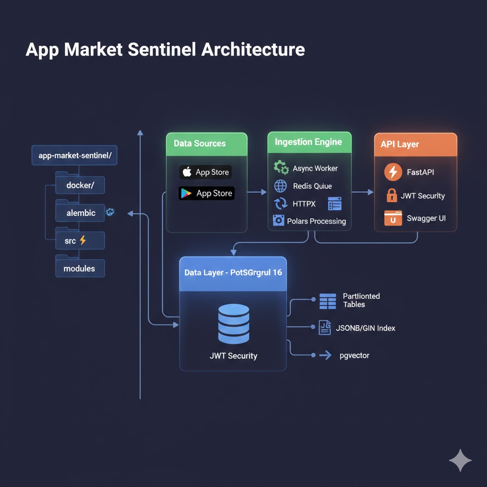

# Market Sentinel

Plataforma async-first de analítica para App Stores e inteligencia competitiva. Ingesta, normaliza y analiza datos (precios, reviews, changelogs) de marketplaces de aplicaciones.

## Tech Stack

- **Python 3.12+** (async-first, fully typed)
- **FastAPI** + Uvicorn (async REST API)
- **PostgreSQL 16** via async SQLAlchemy 2.0 + asyncpg
- **Redis 7** + Arq (async background task queue)
- **Polars** (data processing)
- **Alembic** (migraciones de base de datos async)
- **Docker Compose** (postgres, redis, app)
- **Poetry** (dependency management)

## Comandos de Ejecución

```bash
# Instalar dependencias
poetry install

# Levantar todos los servicios (postgres, redis, app en :8000)
docker compose up --build

# Ejecutar localmente (requiere postgres/redis corriendo por separado)
poetry run uvicorn src.api:app --reload --host 0.0.0.0 --port 8000
```

## Migraciones de Base de Datos (Alembic)

Alembic gestiona la evolución del esquema de PostgreSQL de forma versionada y reproducible. Está configurado para trabajar de forma **asíncrona** con `asyncpg`.

```bash
# Aplicar todas las migraciones pendientes
poetry run alembic upgrade head

# Revertir la última migración
poetry run alembic downgrade -1

# Generar nueva migración automática tras cambiar modelos
poetry run alembic revision --autogenerate -m "descripción del cambio"

# Ver la migración actual
poetry run alembic current

# Ver historial de migraciones
poetry run alembic history
```

### Esquema actual (`001_initial_schema`)

- **`apps`** — Catálogo de aplicaciones con constraint único `(bundle_id, store)`
- **`price_history`** — Serie temporal de precios, particionada por mes (2026-2028) con índices BRIN
- **`reviews`** — Reseñas con columna JSONB `metadata` e índice GIN

## Tests

```bash
# Ejecutar todos los tests
poetry run pytest

# Ejecutar un archivo de test específico
poetry run pytest tests/test_example.py

# Ejecutar con output detallado
poetry run pytest -v

# Ejecutar tests que coincidan con un patrón
poetry run pytest -k "test_nombre"
```

## Lint y Formato

```bash
# Verificar y corregir estilo
ruff check src/ --fix

# Formatear código
ruff format src/

# Pre-commit hooks (instalar una vez)
pre-commit install
pre-commit run --all-files
```

## Arquitectura

```
src/
├── api/          # FastAPI app, REST endpoints
├── core/         # Config (Pydantic Settings), database engine
├── modules/      # Dominios de negocio (apps, scraping, analytics)
└── worker/       # Arq background jobs
```

---

# **`Programa de Alto Rendimiento: AI & AppSec (24 Semanas)`**

- ProgramaDominio de SQL y Python para Datos: Es la base de todo lo que sigue.
- RAG y Orquestación (LangChain): Para entrar en la ola de la IA.
- Docker y Cloud (AWS): Para que dejes de ser un "programador de PC" y seas un "Ingeniero de Sistemas".
- Especialización en Seguridad (AppSec): A largo plazo, para blindar tu carrera.

## Fase 1: Data Engineering & Advanced Backend (Semanas 1-6)

**Objetivo:** Dominar la ingesta masiva de datos. El **DOMINIO DE SQL Y PYTHON PARA DATOS** es lo que separa a un programador de un ingeniero de sistemas.

- **Deep-Dive:** Optimización de planes de ejecución en Postgres, particionamiento de tablas para series temporales (logs) y el modelo de memoria de Polars.
- **Seguridad:** Implementación de Row Level Security (RLS) en PostgreSQL y prevención de Inyección SQL en consultas dinámicas complejas.

| Sem | Tema Principal | Objetivo Técnico |
|---:|---|---|
| 1 | **PostgreSQL Internals** | Tuning de `shared_buffers`, índices GIN para JSONB y `EXPLAIN ANALYZE`. |
| 2 | **Async SQLAlchemy 2.0** | Patrones avanzados de concurrencia y gestión de pools en entornos `async`. |
| 3 | **Polars & Data Processing** | Sustitución de Pandas. Procesamiento Lazy para datasets que no entran en RAM. |
| 4 | **Vector Databases (Foundations)** | Instalación de `pgvector` y comprensión de tipos de indexación (IVFFlat vs HNSW). |
| 5 | **Validation & Data Integrity** | Uso avanzado de Pydantic v2 para tipado estricto en pipelines de datos. |
| 6 | **High Performance APIs** | Benchmarking de FastAPI vs Litestar para servicios de datos intensivos. |

**Capstone Project (Parte I):** Un motor de ingesta asíncrono que procesa logs de red, los normaliza con Polars y los indexa vectorialmente en PostgreSQL.

---

## Fase 2: Generative AI Architecture & RAG (Semanas 7-12)

**Objetivo:** Dejar de usar "wrappers" y construir arquitecturas. Aplicaremos **RAG Y ORQUESTACIÓN (LANGCHAIN)** para crear sistemas con memoria y contexto.

- **Deep-Dive:** Estrategias de Chunking (Semantic vs Recursive), arquitecturas Multi-Agent y manejo de estados persistentes.
- **Seguridad:** Mitigación de fugas de datos en el contexto (Data Leakage) y sanitización de inputs para el LLM.

| Sem | Tema Principal | Objetivo Técnico |
|---:|---|---|
| 7 | **Embeddings & Search** | Comparativa de modelos (OpenAI, HuggingFace, Cohere) y métricas de distancia. |
| 8 | **RAG Avanzado** | Implementación de *Self-Querying* y *Small-to-Big Retrieval*. |
| 9 | **Agentic Workflows** | Uso de LangGraph para flujos cíclicos y toma de decisiones autónoma. |
| 10 | **Memory & Context** | Implementación de memoria de largo plazo usando Redis como vector store. |
| 11 | **Herramientas de IA (CLI)** | Integración profunda de Claude Code y herramientas de terminal para desarrollo. |
| 12 | **Evaluación de Modelos** | Frameworks de testing (DeepEval/Ragas) para medir alucinaciones. |

---

## Fase 3: MLOps & Cloud Infrastructure (Semanas 13-18)

**Objetivo:** Desplegar a escala. Usarás **DOCKER Y CLOUD (AWS)** para que tus modelos sean productivos y resilientes.

- **Deep-Dive:** Orquestación de contenedores para inferencia, auto-scaling basado en latencia y despliegue de modelos *Open Source*.
- **Seguridad:** Hardening de imágenes Docker (Distroless), escaneo de vulnerabilidades en el CI/CD y gestión de secretos en AWS.

| Sem | Tema Principal | Objetivo Técnico |
|---:|---|---|
| 13 | **Docker for AI** | Optimización de imágenes para GPU y reducción de peso de capas. |
| 14 | **AWS Bedrock & SageMaker** | Consumo de modelos Serverless vs despliegue de clusters propios. |
| 15 | **Infrastructure as Code** | Terraform para levantar toda la infraestructura de IA de forma reproducible. |
| 16 | **CI/CD Pipelines** | GitHub Actions para tests automáticos de modelos y despliegue continuo. |
| 17 | **Observabilidad** | Centralización de logs (CloudWatch) y trazabilidad de prompts (LangSmith). |
| 18 | **Cost Optimization** | Estrategias de Spot Instances y caching semántico para bajar costos. |

---

## Fase 4: Offensive & Defensive AI Security - AppSec (Semanas 19-24)

**Objetivo:** Tu especialización final. La **ESPECIALIZACIÓN EN SEGURIDAD (APPSEC)** te diferenciará en el mercado.

- **Deep-Dive:** OWASP Top 10 para LLMs, ataques de Inyección de Prompts y seguridad en la cadena de suministro.
- **Seguridad:** Creación de "Guardrails" para interceptar respuestas maliciosas en tiempo real.

| Sem | Tema Principal | Objetivo Técnico |
|---:|---|---|
| 19 | **LLM Attack Vectors** | Prácticas de Prompt Injection (Directa e Indirecta). |
| 20 | **Insecure Output Handling** | Cómo evitar que un LLM ejecute código malicioso en tu servidor (RCE). |
| 21 | **Guardrails & Filtering** | Implementación de NeMo Guardrails para control de flujo y seguridad. |
| 22 | **Supply Chain Security** | Análisis de vulnerabilidades en librerías de IA y modelos de HuggingFace. |
| 23 | **AI Red Teaming** | Simulación de ataques controlados contra tu propio sistema. |
| 24 | **Hardening Final** | Auditoría de punta a punta y entrega del proyecto final. |




🔍 Análisis de la Arquitectura: Flujo de Datos E2E
La imagen superior detalla la implementación de App Market Sentinel, un sistema diseñado para la resiliencia y el procesamiento masivo de datos (High-Throughput).

📂 Estructura del Repositorio (Panel Lateral)
El proyecto adopta un patrón de Monolito Modular dentro de la carpeta src/.

src/api/: Expone la lógica de negocio mediante FastAPI.

src/worker/: Ejecuta las tareas pesadas de scraping de forma asíncrona mediante Arq.

src/modules/: El núcleo de la inteligencia, donde scraping/ extrae los datos y processor/ los limpia con Polars.

src/core/: Configuración centralizada y observabilidad.

⚙️ Ciclo de Vida de una Petición (Flujo Principal)
Ingesta Inteligente (Bloque Verde): A diferencia de un scraper lineal, el Async Worker utiliza HTTPX con rotación dinámica de User-Agents para evitar bloqueos. La librería Tenacity asegura que, ante fallos de red, el sistema reintente la operación de forma exponencial, garantizando un 99.9% de éxito en la captura.

Validación y Refinado: Antes de tocar la base de datos, cada registro es validado por Pydantic v2. Luego, un pipeline de Polars (escrito en Rust) procesa los textos, elimina información sensible (PII) y normaliza las monedas en milisegundos.

Persistencia Avanzada (Bloque Azul): Los datos se almacenan en PostgreSQL 16 usando técnicas de ingeniería de alto nivel:

Particionamiento: El historial de precios se fragmenta por fechas para mantener consultas rápidas tras años de datos.

JSONB & GIN: Las reviews se guardan como documentos flexibles pero indexados para búsquedas instantáneas.

pgvector: Los datos quedan listos para búsqueda semántica e IA.

Consumo de Alta Performance (Bloque Naranja): La API de FastAPI no consulta las tablas pesadas directamente; lee de Vistas Materializadas pre-calculadas, devolviendo respuestas en menos de 200ms. Todo el flujo está protegido por autenticación JWT y documentado automáticamente bajo el estándar OpenAPI.
